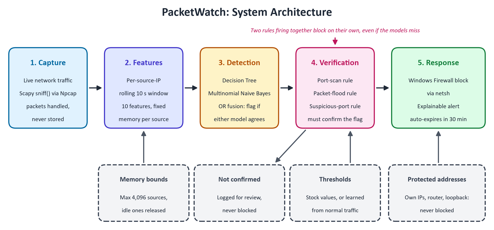

# PacketWatch - the complete review guide

Everything about this project in one place, from the one-minute pitch down to the design details nobody asks about until they do. Read sections 1-3 before the review, skim the rest, and use section 12 (the question bank) to rehearse.

Repository: https://github.com/Aadharsh-s/packetwatch

---

## Contents

1. [The project in one minute](#1-the-project-in-one-minute)
2. [The base paper, and exactly what we add](#2-the-base-paper-and-exactly-what-we-add)
3. [How PacketWatch works, stage by stage](#3-how-packetwatch-works-stage-by-stage)
4. [One attack, followed packet by packet](#4-one-attack-followed-packet-by-packet)
5. [Where the models' knowledge comes from](#5-where-the-models-knowledge-comes-from)
6. [Every evaluation, and how to explain it](#6-every-evaluation-and-how-to-explain-it)
7. [The engineering underneath](#7-the-engineering-underneath)
8. [Problems we found and fixed](#8-problems-we-found-and-fixed)
9. [The optional vulnerability extension](#9-the-optional-vulnerability-extension)
10. [Repository map and history](#10-repository-map-and-history)
11. [Limitations and future work](#11-limitations-and-future-work)
12. [Question bank](#12-question-bank)
13. [Numbers cheat sheet](#13-numbers-cheat-sheet)
14. [Glossary](#14-glossary)

---

## 1. The project in one minute

**Title:** PacketWatch: Lightweight ML Intrusion Prevention

**The problem.** Small offices and individual users face the same network attacks as large organisations - port scans, floods, brute-force logins - but cannot afford enterprise security platforms, which need dedicated servers, Linux infrastructure and specialist staff.

**What we built.** A lightweight, CPU-only intrusion detection **and prevention** system for a single Windows machine. It:

1. captures live network traffic with Scapy;
2. summarises what each remote computer has been doing over the last 10 seconds;
3. classifies that behaviour with a **Decision Tree** and a **Multinomial Naive Bayes** model;
4. requires a **threshold rule** to confirm every flag, so machine learning alone never blocks anyone;
5. blocks the confirmed attacker through **Windows Firewall**, and writes an alert stating exactly why.

**Base paper.** Ismail, Dandan and Qushou, *IEEE Access*, 2025 - a comparison of lightweight machine learning models for intrusion detection, deployed live to monitor and log.

**Our contribution in one sentence.** The base paper detects and logs; PacketWatch detects, **verifies** and **prevents**, with every decision explained and memory that stays bounded under attack.

**The headline numbers.**

| | |
|---|---|
| F1 on scans and floods (CIC-IDS2017) | **0.98**, with a 1.0% false positive rate |
| F1 across all attack types (2.83M flows) | **0.92** |
| Decision Tree model size | **9 KB** (Random Forest: 79 MB) |
| Throughput | **34,000-45,000 packets/second** on one CPU core |
| Time from first attack packet to block | **140 ms** median |
| Memory during a 200,000-packet flood | **7 KB** for that attacker |
| Automated tests | **57** |

---

## 2. The base paper, and exactly what we add

**Citation.** S. Ismail, S. Dandan and A. Qushou, "Intrusion Detection in IoT and IIoT: Comparing Lightweight Machine Learning Techniques Using TON_IoT, WUSTL-IIOT-2021, and EdgeIIoTset Datasets," *IEEE Access*, vol. 13, pp. 73468-73485, 2025. DOI 10.1109/ACCESS.2025.3554083. Open access, peer-reviewed journal paper, 48 citations.

Link: https://ieeexplore.ieee.org/document/10937697

**What the paper does, in seven steps:**

1. Compares lightweight supervised models: Decision Tree, Random Forest, Bagging, Stacking and LightGBM.
2. Uses three IoT/IIoT datasets: TON_IoT, WUSTL-IIoT-2021 and Edge-IIoTset.
3. Selects features with Mutual Information.
4. Studies the effect of class imbalance.
5. Measures precision, recall, micro-F1, model size and training time.
6. Tests cross-dataset transfer: trains on TON_IoT, tests on WUSTL-IIoT-2021.
7. Deploys the models live and monitors CPU, memory and network activity, logging predictions.

**Side by side:**

| | Base paper | PacketWatch |
|---|---|---|
| Models compared | DT, RF, Bagging, Stacking, LightGBM | The same five, plus Multinomial NB |
| Model deployed | Not the focus | DT + Multinomial NB, chosen on the comparison |
| Feature selection | Mutual Information | Mutual Information, on our 10 features and on TON_IoT |
| Metrics | Precision, recall, micro-F1, size, training time | The same, plus macro-F1 and prediction time |
| Datasets | TON_IoT, WUSTL-IIoT-2021, Edge-IIoTset | TON_IoT, CIC-IDS2017, UNSW-NB15 |
| Class imbalance | Studied | Studied; it changed our design (section 8) |
| Cross-dataset transfer | TON_IoT to WUSTL | TON_IoT to and from UNSW-NB15 |
| Live deployment | Monitor and log | Monitor, **verify and block** |
| Rule verification | No | **Yes** - every flag must be confirmed |
| Automatic blocking | No | **Yes** - Windows Firewall, expires after 30 min |
| Explainable alerts | No | **Yes** - rule, observed value, threshold |
| Memory under attack | Not addressed | **Bounded** - 7 KB per flooding source |

**The story to tell:** we repeated the base paper's comparison on our own features and datasets, used it to choose the right lightweight model, and then built what turns detection into prevention.

**Why this base paper instead of VPID.** An earlier version of the project was based on VPID (arXiv:2609.00819), which is only a preprint - not published by IEEE. The college requires an IEEE paper, so we moved to Ismail et al. It fits better anyway: it is about lightweight models, which is exactly what PacketWatch is. VPID is still credited as related work and for the optional vulnerability extension (section 9).

---

## 3. How PacketWatch works, stage by stage



```
Scapy sniff() -> per-source 10 s window -> Decision Tree + Multinomial NB -> rule verification -> Windows Firewall
 (capture.py)      (features.py)              (model.py)                       (verify.py)          (response.py)
                                   all tied together by pipeline.py
```

### Stage 1 - Capture (`packetwatch/capture.py`)

- Uses Scapy's `sniff()` with the Npcap driver. The filter is `ip`, so only IP traffic is examined.
- `store=False`: each packet is handed to our handler and then dropped. **No packet is ever stored.**
- Before starting it checks two things and stops with a clear message if either fails: that it is running as Administrator (`IsUserAnAdmin()`), and that Npcap is installed.
- **Only inbound traffic is judged.** Packets whose source is this machine are skipped.

### Stage 2 - Features (`packetwatch/features.py`)

Every remote IP address gets a rolling 10-second summary (`WINDOW_SECONDS = 10`) made of **10 numbers**:

| # | Feature | Meaning | Why it matters |
|---|---|---|---|
| 1 | `pkt_count` | Packets in the last 10 s | Volume |
| 2 | `pkts_per_sec` | Packets in the busiest single second | Floods; a short burst is not averaged away |
| 3 | `unique_dst_ports` | Different ports contacted (capped at 256) | Port scans |
| 4 | `unique_dst_ips` | Different destinations contacted (capped at 64) | Sweeps across hosts |
| 5 | `tcp_count` | TCP packets | Protocol mix |
| 6 | `udp_count` | UDP packets | UDP floods |
| 7 | `icmp_count` | ICMP packets | Ping floods |
| 8 | `syn_only_count` | TCP packets with SYN set and ACK not set | Half-open scans, SYN floods |
| 9 | `suspicious_port_hits` | Packets to risky ports (SSH, SMB, RDP...) | Brute force |
| 10 | `avg_len_bucket` | Average packet size / 100 | Tiny probe packets vs real data |

All ten are non-negative integers, which Multinomial Naive Bayes requires, because it models counts.

**How they are stored (a hidden corner worth knowing).** Nothing is kept per packet. Each source has a fixed ring of 10 slots, one per second. Each slot holds running counts. When a new second begins, the oldest slot is cleared and reused. So a source costs the same memory whether it sends one packet or a million (section 7).

### Stage 3 - Detection (`packetwatch/model.py`)

- **Decision Tree:** `DecisionTreeClassifier(max_depth=6, random_state=42)`, built by `make_tree()`. Depth 6 keeps it small (9 KB) and readable as rules. **No class weighting** - see section 8.
- **Multinomial Naive Bayes:** scikit-learn defaults. A probabilistic model for count data, and extremely cheap.
- **OR fusion:** a source is *flagged* if **either** model says attack. This deliberately favours catching attacks, and the verification stage removes the resulting false alarms.
- **Batched prediction:** once a second, all sources with new traffic are classified in **one** call, which is 72 times cheaper than classifying them one at a time.

### Stage 4 - Verification (`packetwatch/verify.py`)

Three threshold rules, defined once in a `RULES` table and shared with every evaluation:

| Rule | Fires when | Catches |
|---|---|---|
| `port_scan` | 10 or more different ports in 10 s | Port scans |
| `packet_flood` | 100 or more packets in one second | Floods, DoS |
| `suspicious_port` | 3 or more packets to a risky port | Brute force against services |

Risky ports: 21 FTP, 22 SSH, 23 Telnet, 135 RPC, 139 NetBIOS, 445 SMB, 1433 SQL Server, 3306 MySQL, 3389 RDP, 4444 (common backdoor), 5432 PostgreSQL, 5900 VNC, 6667 IRC.

**The decision logic (the heart of the project):**

```
flagged = DT says attack  OR  NB says attack
hits    = the rules this source broke

BLOCK if  (flagged AND at least one rule)      <- "ml+rule" trigger
      or  (two or more different rules)        <- "rules-only" trigger

otherwise, if flagged: log "ML-flagged, not verified" - never block
```

- **Why verification matters:** the models alone flag 6.5% of normal traffic on CIC-IDS2017, and requiring a rule to confirm cuts that to 3.1%.
- **Why two rules can block alone:** models trained on some attack types missed attacks they had never seen, which the rules caught clearly. Letting two rules act independently fixed that (cross-day recall 44% to 99%).
- **Severity:** HIGH by default. CRITICAL when one source breaks two or more different rules within 60 seconds (`Correlator`).

### Stage 5 - Response (`packetwatch/response.py`)

For a confirmed attacker, two Windows Firewall rules are added:

```
netsh advfirewall firewall add rule name=PacketWatch_Block_<ip>_in  dir=in  action=block remoteip=<ip> enable=yes
netsh advfirewall firewall add rule name=PacketWatch_Block_<ip>_out dir=out action=block remoteip=<ip> enable=yes
```

**Safety built in:**

- Blocks lift automatically after **30 minutes** (`BLOCK_TTL_MIN`).
- These addresses are **never** blocked: this machine's own IPs, the default gateway (router), loopback, and anything passed with `--whitelist`.
- IP addresses are validated with Python's `ipaddress` module before use, and `netsh` is run **without a shell**, so a malformed value cannot inject commands.
- `--dry-run` prints the firewall commands instead of running them.
- `--unblock-all` removes every rule whose name starts with `PacketWatch_Block_`.

**Every alert** is printed in colour and saved as one JSON line in `alerts.log`:

```json
{"time": "...", "src_ip": "10.0.0.66", "severity": "HIGH", "trigger": "ml+rule",
 "classifiers": {"dt": true, "nb": true, "dt_proba": 1.0, "nb_proba": 1.0, "flagged": true},
 "rule_hits": [{"rule": "port_scan", "observed": 51, "threshold": 10, "unit": "unique dst ports"}],
 "explanation": ["port_scan: observed 51 unique dst ports >= threshold 10"],
 "action": "blocked"}
```

### The glue - `packetwatch/pipeline.py`

- `handle(pkt)` is called by Scapy for every packet. It updates the source's window and marks it as having new traffic.
- `sweep()` runs at most once a second. It is triggered by incoming packets **and** by a background ticker thread, so a burst is still judged after the attacker goes quiet.
- A statistics line is printed every 30 seconds.

---

## 4. One attack, followed packet by packet

Someone on the network runs `nmap -Pn -T4 -p 1-300` against the laptop.

1. **0.00 s** - the first SYN arrives from 10.0.0.66 to port 1. `sniff()` hands it to `handle()`. A new `SourceWindow` is created for 10.0.0.66 and the packet is counted: TCP, SYN-only, port 1.
2. **0.00-1.00 s** - more SYNs arrive to ports 2, 3, 4... Each updates the counters in the current second's slot. Nothing is stored per packet.
3. **About 1.00 s** - the once-a-second sweep runs. The window now says something like: 250 packets, 250 in the busiest second, 250 distinct ports, all SYN-only.
4. **Detection** - the Decision Tree and Naive Bayes both score it as an attack (probability 1.0). Flagged.
5. **Verification** - `port_scan` fires (250 ports, threshold 10) and `packet_flood` fires (250 per second, threshold 100). Two rules.
6. **Severity** - two different rules within 60 seconds, so CRITICAL.
7. **Response** - `netsh` adds the inbound and outbound block rules for 10.0.0.66 and starts a 30-minute expiry timer.
8. **Alert** - printed and logged: `[CRITICAL] 10.0.0.66 -> blocked | trigger=ml+rule | port_scan: observed 250 ... ; packet_flood: observed 250 ...`

Total time from the first packet to the block: about 140 ms median in the benchmark. It is bounded by the one-second sweep interval.

**The slow-scan case (what happened in our live test).** A phone scanner sending about one probe per second never builds up 10 ports inside the 10-second window. The models still flag it, but no rule confirms, so it is logged as *ML-flagged, not verified* and not blocked. This is the verification layer doing its job - refusing to block on weak evidence. Scanning the risky ports instead trips `suspicious_port` after 3 packets, even when the scan is slow.

---

## 5. Where the models' knowledge comes from

**The deployed models are trained on synthetic traffic** generated by `generate_training_data()` in `model.py`: about 5,000 samples, balanced between normal and attack.

| Normal profiles | Attack profiles |
|---|---|
| Web browsing | Fast SYN port scan |
| DNS lookups | Slow port scan |
| Video streaming | UDP flood |
| LAN background chatter | ICMP (ping) flood |
| | SYN flood |
| | Brute force against risky ports |

Each profile produces randomised feature vectors covering attacks at every stage. For example, a flood seen 1 second in looks different from one seen 10 seconds in, and both are included.

**Why synthetic, not real data? This was tested, not assumed.** Models trained on real public captures (UNSW-NB15) were tried three ways. They reached 98.5% recall on that dataset but flagged a quarter of its normal traffic, and **when shown ordinary traffic they flagged 99% of it as an attack**. The reason: those captures' "normal" traffic is machine-generated and unnaturally dense, so a model trained there treats ordinary browsing as suspicious. CIC-IDS2017 cannot supply windowed training data either, because its attack days record time only to the minute.

**To train on your own traffic:** record it with `--record rows.csv`, fill in the `label` column (0 normal, 1 attack), and retrain with `--train --csv rows.csv`.

---

## 6. Every evaluation, and how to explain it

Each script under `evaluation/` rewrites a report (`*.md`) and a matching `*.json` with the raw numbers.

### 6.1 Model comparison - the base paper's protocol (`MODEL_COMPARISON.md`)

All six models trained identically (no class weighting) on PacketWatch's 10 features.

**UNSW-NB15** (802,356 windows, attack vs. normal):

| Model | F1 | False alarms | Size | Per prediction |
|---|---|---|---|---|
| **Decision Tree** | **0.733** | 0.95% | **9 KB** | **0.09 us** |
| LightGBM | 0.810 | 0.74% | 1.4 MB | 12.4 us |
| Bagging | 0.827 | 0.73% | 34 MB | 5.1 us |
| Stacking | 0.827 | 0.68% | 39 MB | 2.4 us |
| Random Forest | 0.829 | 0.71% | 79 MB | 4.2 us |

**How to explain it:** "The ensembles gain about 0.1 F1, but Random Forest needs 79 MB against 9 KB and is about 45 times slower per prediction. For a tool that runs constantly on one PC, the Decision Tree gives 88% of the accuracy at a tiny fraction of the cost."

**Mutual Information ranking (UNSW-NB15):** packets per second (0.105), TCP count (0.084), packet count (0.081) and distinct ports (0.031) matter most. SYN-only and ICMP counts carry almost nothing. The top 5 features alone do as well as all 10 (F1 0.737 vs 0.733), which confirms the ranking.

**On CIC-IDS2017** every model lands around F1 0.30-0.34 per window, because its big attacks collapse into very few windows. The report shows macro-F1 beside micro-F1 so the 99.8%-normal imbalance cannot inflate the picture.

### 6.2 TON_IoT - the base paper's own dataset (`TON_IOT_EVALUATION.md`)

211,043 records: 50,000 normal, 20,000 each of scanning, DDoS, DoS, backdoor, injection, password, ransomware and XSS, plus 1,043 MITM.

| Model | F1 | Size |
|---|---|---|
| **Decision Tree** | **0.994** | **9 KB** |
| LightGBM | 0.998 | 1.4 MB |
| Random Forest | 0.998 | 6.9 MB |

- **Method, as in the paper:** per-record classification on the dataset's own fields. IPs, source ports and free-text fields are dropped so models learn behaviour, not hostnames.
- **MI selection** chose 8 features: destination port, source and destination IP bytes, connection state, source bytes and packets, protocol and service.
- **Why not PacketWatch's windows here:** this file has no timestamps, so time windows cannot be built. The report says so openly.
- **Cross-dataset transfer:** trained on TON_IoT and tested on UNSW-NB15, or the reverse, every model collapses to **F1 0.05-0.22**. Models do not carry over between network environments. Say this plainly - it is an honest finding that tests the base paper's generalisation claim.

### 6.3 The full pipeline on CIC-IDS2017 (`EVALUATION.md`)

2.83 million flows across eight capture files: scans, DoS, DDoS, FTP/SSH brute force, web attacks, infiltration, Heartbleed and botnet.

| Metric | PacketWatch (per flow, random 70/30 split) |
|---|---|
| Precision | 88.3% |
| Recall | 96.7% |
| F1 | 92.3% |
| False positive rate | 3.08% |

- **Scans and floods only:** F1 **0.981**, false positive rate **1.00%**.
- **Attacks from days not seen in training:** recall **98.8%**.
- **Two ways of counting, both reported.** *Per window*: one window is one block decision, which is harsh because attacks collapse into few windows. *Per flow*: every flow takes its window's verdict, which is how most papers report. The per-flow numbers are the headline; the per-window ones are in the report too.
- **A forced deviation:** three of the eight files record time only to the minute, so windows are 60 seconds in this evaluation rather than the live system's 10.

**Per attack type:** port scans, DDoS, DoS Hulk, and FTP and SSH brute force are caught at 99.6-100%. Slow DoS (slowloris, GoldenEye), web attacks and botnet traffic pass at 0% - the known blind spot (section 11). The scans-and-floods figures are in `EVALUATION_SCANS_FLOODS.md`.

### 6.4 UNSW-NB15 at real 10-second windows (`UNSW_EVALUATION.md`)

The one dataset where windows can be built at exactly the live system's 10 seconds, with a true peak-per-second rate.

- **The result is unflattering, and that is the point.** UNSW-NB15's attacks are low-volume exploits and fuzzing that are *quieter* than its machine-generated normal traffic (median normal window: 62 packets at 44 per second; median attack window: 12 packets at 8 per second). Volume thresholds are inverted here, and the pipeline blocks about **10%** of attack windows.
- It also shows why the deployed models are not trained on this data (section 5).
- **Calibration** (`--calibrate`) cuts the rules' false positives from 21.8% to 2.8% here, but cannot rescue detection of attacks quieter than normal traffic.

### 6.5 Benchmark (`BENCHMARK.md`)

Measured on the real pipeline with only the `netsh` call stubbed out.

| | |
|---|---|
| Throughput | 34,000-45,000 packets/second on one core |
| Time to block | 140 ms median, 272 ms worst |
| Memory per source | about 6 KB, fixed |
| One source flooding 200,000 packets | 7 KB |
| One source scanning all 65,535 ports | 16 KB |
| 20,000 spoofed source addresses | 27 MB, capped at 4,096 tracked |
| Idle CPU | under 1% |

For scale, saturating a 100 Mbit/s link with full-size packets is about 8,300 packets per second.

---

## 7. The engineering underneath

These are the hidden corners - design details that show the system was engineered, not just assembled.

### Bounded memory (`features.py`, `pipeline.py`)

The first design kept every packet of the last 10 seconds. A 20,000 packet/second flood therefore stored 200,000 objects for one attacker - **flooding the machine was itself a way to exhaust its memory**. The redesign:

| Situation | Before | After |
|---|---|---|
| One source flooding 200,000 packets | 25.7 MB | 7 KB |
| One source scanning all 65,535 ports | 10.5 MB | 16 KB |
| 120,000 spoofed addresses | unbounded | capped at 4,096 sources |

Every structure that could grow is capped, with the limits in `config.py`:

- at most 4,096 tracked sources, oldest dropped first (an LRU `OrderedDict`);
- sources silent for 60 seconds are released, from the sweep, so it happens even without new traffic;
- at most 256 distinct ports per source - well above any threshold that can fire, so a full scan is still caught;
- the alert correlator forgets addresses whose alerts have expired;
- firewall expiry timers are discarded once they fire;
- `alerts.log` rotates at 5 MB and keeps 3 old files;
- calibration keeps a fixed-size random sample (reservoir sampling).

**The honest trade-off:** each source now costs about 6 KB fixed, up from about 1 KB for a quiet source in the old design, in exchange for never growing under attack.

### Two speed fixes found by benchmarking

1. **Reading a packet's length.** `len(pkt)` makes Scapy rebuild the entire packet, recomputing checksums, just to count bytes. It was 88% of per-packet time. `packet_length()` reads the IP header's length field instead. **13.6 times faster.**
2. **Batched classification.** Calling scikit-learn once per source costs mostly call overhead. Classifying every pending source in one call per sweep is **72 times cheaper**.

### Threshold calibration (`calibrate.py`)

`python -m packetwatch --calibrate 300 --iface "Wi-Fi"` watches 300 seconds of normal traffic, takes the 99.9th percentile of what each source did, and writes `packetwatch/models/thresholds.json`, loaded on the next start. Floors and ceilings stop a quiet baseline from making the rules trigger-happy, or a busy one from making them blind. Effect on the rules' false positives: 21.8% to 2.8% on UNSW-NB15, and 1.64% to 0.37% on CIC-IDS2017.

### One definition of each rule

The three rules live in one `RULES` table in `verify.py`. Both the live system and every evaluation import it, and a test checks the two paths agree on 200 random inputs. Changing a threshold therefore changes what the evaluations measure too - they cannot silently drift apart.

### Safety as a design principle

- Never blocks its own machine, the router or loopback. Blocking your own gateway would take the machine off the network - an IPS that can do that is a denial-of-service tool against its owner.
- Validates IPs, runs `netsh` without a shell, blocks expire, and `--unblock-all` is always available.

### Tests (`tests/`)

57 tests, needing no Administrator rights or network. They cover the decision logic (scan, flood and brute-force blocking; benign traffic allowed; ML-only flags not blocked; two-rule independent blocking), firewall safety (whitelist, invalid IP rejection, dry run, unblock-all parsing), memory bounds (window size identical for 50 and 50,000 packets, source cap, idle eviction, log rotation), calibration, and the vulnerability module.

---

## 8. Problems we found and fixed

Good material for a "challenges faced" slide - each one was found by measuring, not guessing.

| Problem | How it showed up | Fix |
|---|---|---|
| Floods not caught early | Training data only had fully developed floods | Train on attacks at every stage |
| Short bursts never judged | Judging only happened when the same source sent again | Once-a-second sweep plus a background ticker |
| Memory grew with attack volume | 25.7 MB for one flooding source | Fixed per-second counters (7 KB) |
| 88% of time spent reading packet length | Benchmark profiling | Read the IP header field (13.6x faster) |
| One call per source to the model | Benchmark | One batched call per sweep (72x cheaper) |
| Unseen attacks never blocked | Cross-day test: 44% recall | Two rules can block on their own (99%) |
| SSH brute force invisible | Per-attack table: SSH 0%, FTP 100% | Added port 22 to the risky ports |
| Class weighting hurting accuracy | Model comparison: F1 0.73 vs 0.44 | Removed weighting; shared `make_tree()` |
| LightGBM training diverging | Scored 0.43 on its own training data | Lower learning rate (0.02); now matches Random Forest |
| A constant feature scored as important | MI said a feature that is always 1 was top-ranked | Discrete MI estimator, correct for counts |
| Rules defined in three places | Code review | One shared `RULES` table plus a consistency test |
| README corrupted on GitHub | PowerShell `echo >>` writes UTF-16 | Repaired, byte-identical to the original |

---

## 9. The optional vulnerability extension

Beyond the base paper, and inspired by VPID. Present it only if there is time.

- **What it does:** reads an OpenVAS scan report and ranks vulnerabilities by how likely they are to be exploited: first CISA's list of known-exploited vulnerabilities (KEV), then EPSS exploit-prediction scores, then a decision tree, then CVSS severity. Each item says which signal decided its rank.
- **Why a cascade, not just a decision tree:** tested on 260,000 real CVEs, a decision tree over CVE fields ranked *worse* than the CVSS score it was built from (AUC 0.71 vs 0.77), while EPSS reached 0.97. See `VULN_EVALUATION.md`.
- **Exposure checks** connect to a flagged service and read its banner - they never attack it - and refuse non-private addresses unless `--allow-external` is passed.
- **Linking to the detector:** `--risk-map risk.json` makes traffic aimed at a known-vulnerable port block on one rule instead of two, escalate to CRITICAL and name the CVE.

```
python -m packetwatch.vuln --report tests/fixtures/openvas_report.xml --json risk.json
python -m packetwatch --simulate --risk-map risk.json
```

---

## 10. Repository map and history

```
packetwatch/
  __main__.py     command-line interface: python -m packetwatch ...
  config.py       every threshold and limit, in one place
  capture.py      Scapy sniff() with Administrator and Npcap checks
  features.py     per-source rolling window, 10 features, fixed memory
  model.py        Decision Tree + Naive Bayes, make_tree(), synthetic training data
  verify.py       the three rules (RULES table) and severity correlation
  pipeline.py     packet -> features -> models -> rules -> block + alert
  response.py     Windows Firewall blocking, JSON alerts, log rotation
  calibrate.py    learns thresholds from normal traffic
  simulate.py     offline demo
  riskmap.py      applies vulnerability findings (optional)
  vuln/           OpenVAS parsing, ranking, exposure checks (optional)
evaluation/       model_comparison, ton_iot, cicids2017, unsw_nb15, benchmark, vuln_priority
docs/             architecture and ER diagrams (python docs/architecture.py regenerates)
tests/            57 tests
*.md              README, DEMO (the demo runbook), this guide, and the evaluation reports
```

About 4,800 lines of Python.

**Git history, oldest first:**

| Commit | What |
|---|---|
| 8af8e81 | The complete system: capture, detection, verification, blocking, evaluations, 46 tests |
| 4cf2f35 | Memory bounded under attack (3,700x less during a flood) |
| 402965e | DEMO.md review runbook |
| 8478ff8 | First push to GitHub |
| cdc75cf, 3088df0 | Architecture and ER diagrams |
| 64331cd | Model comparison following the new base paper |
| 70fa9bc | README repaired after the UTF-16 corruption |
| 89313d6 | Class weighting removed; TON_IoT evaluation added; LightGBM stabilised |
| 6ce1eef | README and DEMO rewritten around the new base paper |

---

## 11. Limitations and future work

**Limitations - state these before anyone asks:**

1. **No payload inspection.** The rules see volume and port spread, not content. Slow DoS, web attacks (brute force, XSS, SQL injection) and botnet traffic arrive on ports 80/8080 at ordinary rates and pass undetected.
2. **Synthetic training data.** Tested and chosen deliberately (section 5), but real-traffic training remains open.
3. **Results do not transfer between networks.** Every model collapses when trained on one dataset and tested on another. Thresholds should be calibrated per deployment.
4. **Two of the base paper's three datasets not evaluated.** WUSTL-IIoT-2021 has no public mirror; Edge-IIoTset was not prioritised.
5. **Spoofed addresses.** Like any IPS that blocks by source IP, a flood with forged source addresses could get an innocent address blocked. Mitigations: your own machine and router are never blocked, blocks expire in 30 minutes, and `--whitelist` protects important hosts.
6. **Windows only.** Blocking uses `netsh`. Porting means swapping in iptables or nftables.
7. **Blocks from a crashed run** stay until `--unblock-all` is run.

**Future work:**

1. Payload inspection (for example integrating Snort) to cover application-layer attacks.
2. Training on labelled real traffic captured in the deployment environment.
3. A dashboard showing live alerts, blocked hosts and traffic over time.
4. A database (for example SQLite) for long-term alert history, following the ER diagram.
5. Evaluating on Edge-IIoTset and WUSTL-IIoT-2021, to complete the base paper's dataset set.

---

## 12. Question bank

### About the idea

**What is the difference between an IDS and an IPS?**
An intrusion detection system raises alerts; an intrusion prevention system also acts to stop the attack. PacketWatch is both: it detects, then blocks through Windows Firewall.

**What problem are you solving?**
Small offices and individuals face the same attacks as enterprises but cannot afford enterprise security. PacketWatch runs on one ordinary PC, on the CPU, with no extra security software.

**What is your base paper, and what did you add?**
Ismail, Dandan and Qushou, *IEEE Access*, 2025 - a comparison of lightweight ML models for intrusion detection, deployed to monitor and log. We repeated their comparison and added rule verification, automatic blocking, explainable alerts and bounded memory: the step from detection to prevention.

**Is this just the base paper reimplemented?**
No. The paper compares models and logs predictions. We used its comparison method to choose our model, then built everything the paper does not have: verification, blocking, explainability, memory safety, calibration and a live Windows deployment.

### About the design

**Why a Decision Tree and not Random Forest, which scored higher?**
On UNSW-NB15, Random Forest scores F1 0.829 against 0.733, but it is 79 MB against 9 KB and about 45 times slower per prediction. On TON_IoT the tree scores 0.994 against 0.998. The tree gets 88-99% of the accuracy at a tiny fraction of the cost, needs no tuning, and its decisions can be read as rules.

**Why two models? Why Naive Bayes?**
Naive Bayes is even cheaper and suits count features. It catches some cases the tree misses. Either one can flag a source, and the rules filter false alarms.

**What is OR fusion, and isn't it risky?**
Flag the source if either model says attack. On its own it would cause false alarms, which is why nothing is blocked unless a rule also confirms it.

**Why do you need rules if you have machine learning?**
Machine learning alone makes mistakes a user cannot inspect. The rules are deterministic and explainable, and they cut false alarms roughly in half. They also catch unseen attacks the models miss.

**Why a 10-second window?**
Long enough to see a scan build up across ports, short enough to react within a second or two, and small enough in memory.

**Why a depth-6 tree?**
Deep enough to separate the attack profiles, small enough to stay at 9 KB and be read as rules. Deeper trees overfit.

**Why no Snort?**
The base paper does not use it. Our rules are simpler and fully explainable. Snort's payload inspection is the natural next step for the blind spot.

**Why Windows?**
The target user - a small office or individual - most likely runs Windows, and most academic IDS work assumes Linux.

**What happens if it blocks a legitimate host by mistake?**
The block lifts after 30 minutes, `--unblock-all` removes all blocks at once, and important hosts can be protected with `--whitelist`. The system never blocks your own machine or router.

**Can an attacker trick it into blocking someone else?**
With forged source addresses, in principle yes - a limitation of every IPS that blocks by IP. That is why blocks expire, the router and your own machine are never blocked, and whitelisting exists.

**What if someone floods it to crash it?**
Memory is bounded: a 200,000-packet flood costs 7 KB, and the worst case is capped at 27 MB. Npcap's kernel buffer is fixed-size and drops packets rather than growing.

### About the data and results

**Where does your training data come from?**
Synthetic traffic patterns we generated. Training on real public captures was tested three ways, and those models flagged up to 99% of ordinary browsing as attacks.

**How accurate is it?**
F1 0.92 across all attack types on 2.83 million CIC-IDS2017 flows, and 0.98 on the scans and floods it is designed for, with a 1% false positive rate. Quote both, the lower one first.

**What can it not detect?**
Attacks that look like normal browsing: slow DoS, web attacks, botnet traffic. They need payload inspection.

**Why is UNSW-NB15 performance so low?**
Its attacks are quieter than its machine-generated normal traffic, so volume-based rules are inverted there. We report it openly; it defines the system's boundary.

**What is cross-dataset transfer, and what did you find?**
Train on one dataset, test on another. Every model collapsed to F1 0.05-0.22. Models learn the specific network they were trained on, which is why per-host calibration matters.

**What is Mutual Information?**
A measure of how much knowing a feature reduces uncertainty about the label. It ranks features by usefulness. For us, packet rate and packet counts matter most.

**What is class imbalance, and did it matter?**
Attacks are rare compared with normal traffic. It mattered a lot: a class-balanced tree scored F1 0.44 with 16.8% false alarms against 0.73 and 0.95% unweighted, so we removed the weighting.

**Why did you not use all three of the base paper's datasets?**
WUSTL-IIoT-2021 has no public mirror. We prioritised TON_IoT, the paper's primary dataset, and added CIC-IDS2017 and UNSW-NB15, which can test the live pipeline itself.

**Is your base paper published by IEEE?**
Yes: *IEEE Access*, vol. 13, 2025, a peer-reviewed IEEE journal. It is not an "IEEE Transactions" title; *IEEE Access* is IEEE's open-access journal.

### About the live demo

**Why doesn't scanning from the same laptop trigger anything?**
By design: the machine never judges or blocks its own traffic.

**Why did the phone hotspot not work?**
On a hotspot the phone is the router, and the router is never blocked. Use router Wi-Fi, or a third device.

**Why did nmap not trigger a block at first?**
Windows Firewall drops nmap's "is the host alive?" check, so nmap gave up before scanning. `-Pn` skips that check. PacketWatch still saw those probes - it watches the network adapter directly.

**The scan was logged but not blocked - is that a bug?**
No. The scan was too slow to cross any threshold. The models flagged it, no rule confirmed it, so it was logged and not blocked - verification refusing to act on weak evidence.

---

## 13. Numbers cheat sheet

| Fact | Value |
|---|---|
| Features per source | 10 |
| Window length | 10 s |
| Decision Tree depth / size | 6 / 9 KB |
| Port-scan / flood / suspicious-port thresholds | 10 ports / 100 pkt/s / 3 hits |
| Block expiry | 30 min |
| CIC-IDS2017 flows | 2.83 million |
| Pipeline F1 (all attacks, per flow) | 0.923 |
| Precision / recall / false positives | 88.3% / 96.7% / 3.08% |
| F1 on scans and floods | 0.981 (1.00% false positives) |
| Recall on unseen-day attacks | 98.8% |
| Models alone, false positives | 6.5% (verified: 3.1%) |
| UNSW-NB15: DT vs RF F1 | 0.733 vs 0.829 |
| UNSW-NB15: DT vs RF size | 9 KB vs 79 MB |
| TON_IoT records / DT F1 | 211,043 / 0.994 |
| Cross-dataset F1 | 0.05-0.22 |
| Throughput | 34,000-45,000 packets/s |
| Time to block | 140 ms median |
| Memory: flood / per source / cap | 7 KB / 6 KB / 27 MB |
| Class weighting effect (UNSW) | F1 0.44 weighted vs 0.73 unweighted |
| Speed fixes | 13.6x (packet length), 72x (batching) |
| Tests | 57 |
| Lines of Python | about 4,800 |

---

## 14. Glossary

| Term | Meaning |
|---|---|
| **IDS / IPS** | Intrusion detection system (alerts) / intrusion prevention system (alerts and blocks) |
| **Scapy** | Python library for capturing and building network packets |
| **Npcap** | Windows driver that lets programs capture raw network traffic |
| **netsh** | Windows command-line tool; `netsh advfirewall` manages the firewall |
| **Port scan** | Probing many ports to find running services |
| **SYN / SYN-only** | The first packet of a TCP connection; SYN without ACK means a connection that was never completed, typical of scans |
| **Flood / DoS / DDoS** | Overwhelming a target with traffic, from one source or many |
| **Brute force** | Repeatedly guessing logins against a service such as SSH or RDP |
| **Decision Tree** | A model that decides through a sequence of yes/no questions on the features |
| **Multinomial Naive Bayes** | A probabilistic model for count data, assuming features are independent |
| **Random Forest / Bagging / Stacking** | Ensembles that combine many models for higher accuracy at higher cost |
| **LightGBM** | A fast gradient-boosted tree ensemble |
| **Precision** | Of everything flagged, the share that really was an attack |
| **Recall** | Of all real attacks, the share that was caught |
| **F1** | The balance of precision and recall, from 0 to 1 |
| **False positive rate** | The share of normal traffic wrongly flagged |
| **Micro-F1 / macro-F1** | F1 across all samples / averaged equally across classes, which exposes rare classes |
| **Mutual Information** | How much a feature tells you about the label |
| **Class imbalance** | One class, here normal traffic, heavily outnumbering the other |
| **Cross-dataset transfer** | Training on one dataset and testing on another |
| **Per window / per flow** | Counting results by block decision / by individual connection |
| **CIC-IDS2017, UNSW-NB15, TON_IoT** | Public labelled network traffic datasets used for evaluation |
| **CVE / CVSS / KEV / EPSS** | Vulnerability ID / severity score / CISA's known-exploited list / exploit-probability score |
